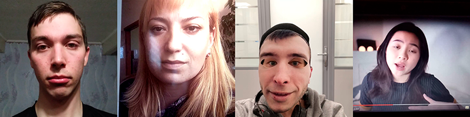

https://github.com/datasouls/idrnd-antispoofing-challenge

# ID R&D antispoofing challenge

Материалы к соревнованию по определению обмана при идентификации по лицу с помощью камеры.

## Описание задачи

Всё чаще для идентификации пользователей используется камера телефона или ноутбука. Это приводит к попыткам обмана алгоритмов проверки лица. Делают это разными способами: снимают на камеру видео с другого экрана или распечатанный портрет, надевают фотографию поверх своего лица.

Участникам соревнования предлагается построить алгоритм, который будет детектировать обман при идентификации по лицу с помощью камеры на основе последовательности кадров.

Пример реального изображения и трёх видов spoof-атак:



## Формат набора данных

Для решения задачи участникам предоставляется набор из \~11500 примеров, каждый из которых представляет собой последовательность из 5 кадров, полученных одинаковым способом из видеозаписи.

В обучающей выборки класс "spoof" (обман) представлен в виде 3 отдельных классов:

- 2dmask — надетая на лицо распечатанная фотография
- printed — съёмка распечатанной фотографии
- replay — съёмка видеозаписи.

Изображения на этапе тестирования аналогичные. В публичной и приватных частях примерно по 1200 объектов.

## Формат решения

В качестве решений принимается алгоритм (код + необходимые файлы) и описание точки запуска в виде одного архива. В корне архива с решением должен лежать файл `meta.json` со структурой:

```
{
	"image": "<docker image>",
	"entrypoint": "<entry point or sh script>"
}
```

Например:
```
{
   "image": "ksanvatds/idrnd-antispoof",
   "entrypoint": "python3 predict.py --path-images-csv $PATH_INPUT/meta.csv --path-test-dir $PATH_INPUT --path-submission-csv $PATH_OUTPUT/solution.csv"
}
```

Заданы переменные окружения:

1. `PATH_INPUT` — путь до директории с данными

2. `PATH_OUTPUT` — путь до директории для сохранения предсказаний.


Доступны следующие файлы:

1. `$PATH_INPUT/meta.csv` — таблица с информацией об объектах для предсказания и путями до них.  Таком образом, первое изображение для первого объекта можно открыть, используя путь `$PATH_INPUT/sample_1/sample_1_01.png` Пример файла:

   ```
   id,frame,path
   sample_1,1,sample_1/sample_1_01.png
   sample_1,2,sample_1/sample_1_02.png
   sample_1,3,sample_1/sample_1_03.png
   sample_1,4,sample_1/sample_1_04.png
   sample_1,5,sample_1/sample_1_05.png
   sample_2,1,sample_2/sample_2_01.png
   ...
   ```

2. `$PATH_OUTPUT/solution.csv` — таблица, в которую нужно записать предсказания. Пример файла:

   ```
   id,prediction
   sample_1,0.99
   sample_2,0.001
   sample_3,0.3
   ...
   ```

Решение запускается в docker-контейнере, базовым образом выступает`ksanvatds/idrnd-antispoof`, аналогичный образу Kaggle с GPU (собран из [коммита](https://github.com/Kaggle/docker-python/commit/2cac9bf6e233db4b8de405e53e74293a9227b53a)). Имеется CUDA 10, CUDNN 7.4 и актуальные версии библиотек. При желании можно указать свой образ.

Доступные ресурсы:
- 4 ядра CPU (2.3 GHz)
- 8Gb RAM
- Видеокарта NVidia Tesla K80

Ограниченя:
- 4Gb памяти для рабочей директории
- 200Mb на архив с решением
- 25Mb на выходную таблицу
- 20 минут на работу решения

Пример решения вместе с примером данных можно скачать на странице соревнования.

## Оценка качества

Для оценки качества используется следующая функция:

metric = min(P(falsealarm) + 19 P(miss)) by threshold = min(FP/(FP+TN) + 19 FN/(FN+TP))) by threshold.

threshold — порог бинаризации вероятностей в метки, то есть метрика — минимальное значение P(falsealarm) + 19 P(miss) по всевозможным порогам. Положительным классом label=1 считается spoof. P(falsealarm) —  вероятность ложной тревоги, то есть посчитали за spoof то, что было реальным. P(miss) — вероятность пропустить spoof.

## Рекомендации по решению задачи

Начать решение конкурса можно с baseline-решения, основанного на finetuning предобученной на ImageNet сети и усреднением вероятностей по кадрам.
